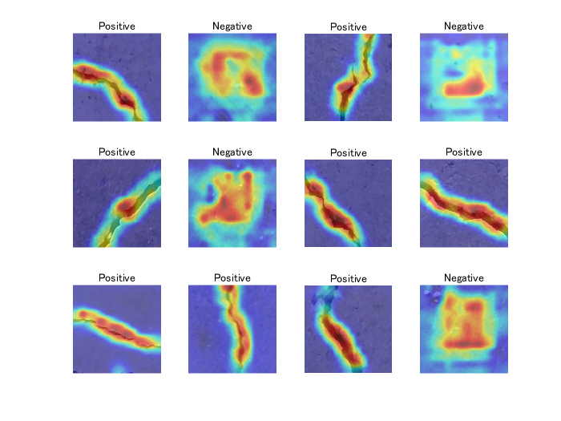
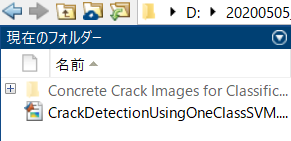
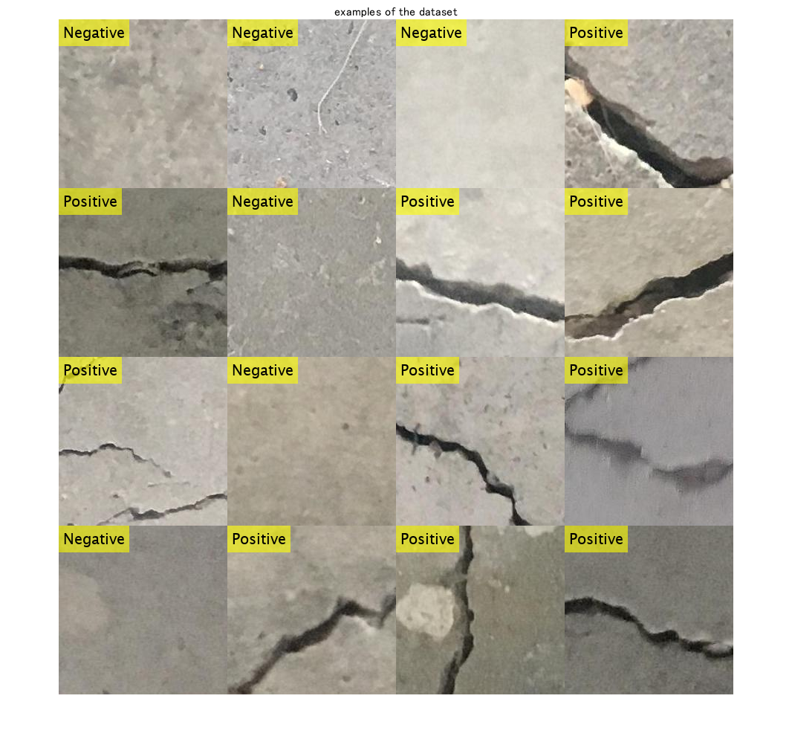
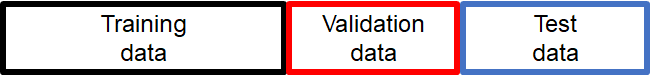
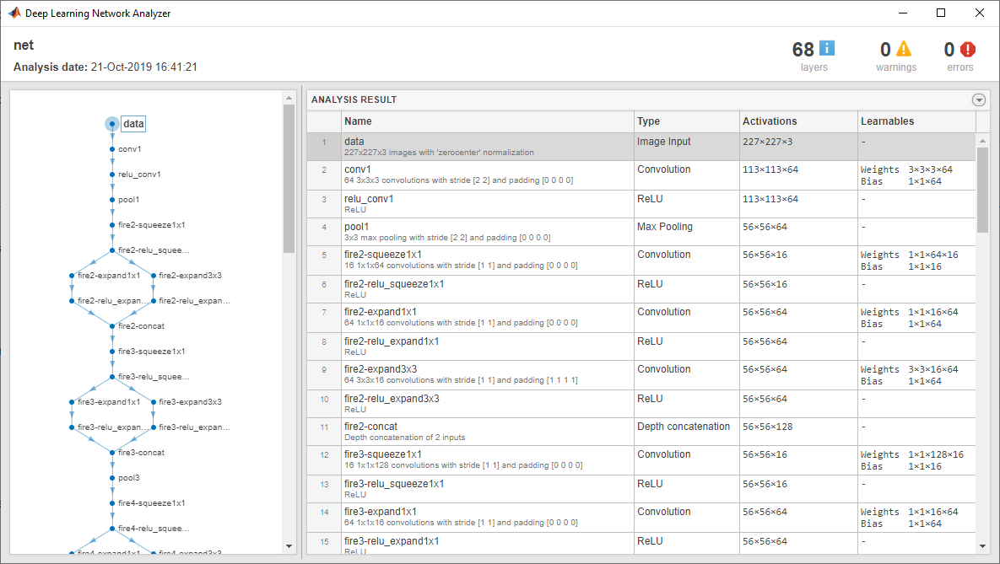
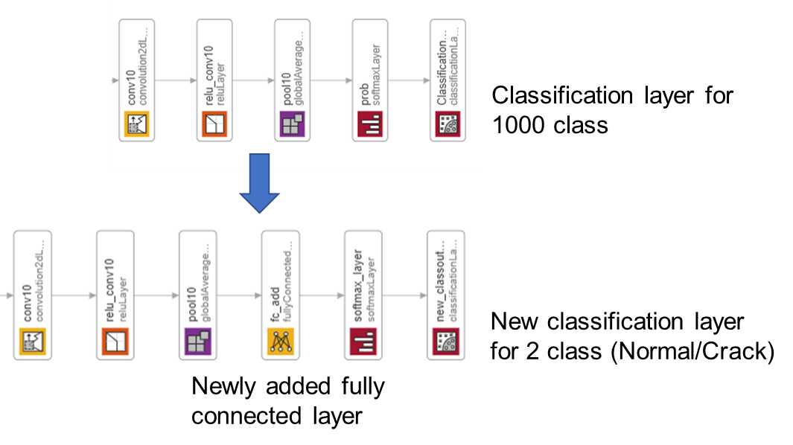
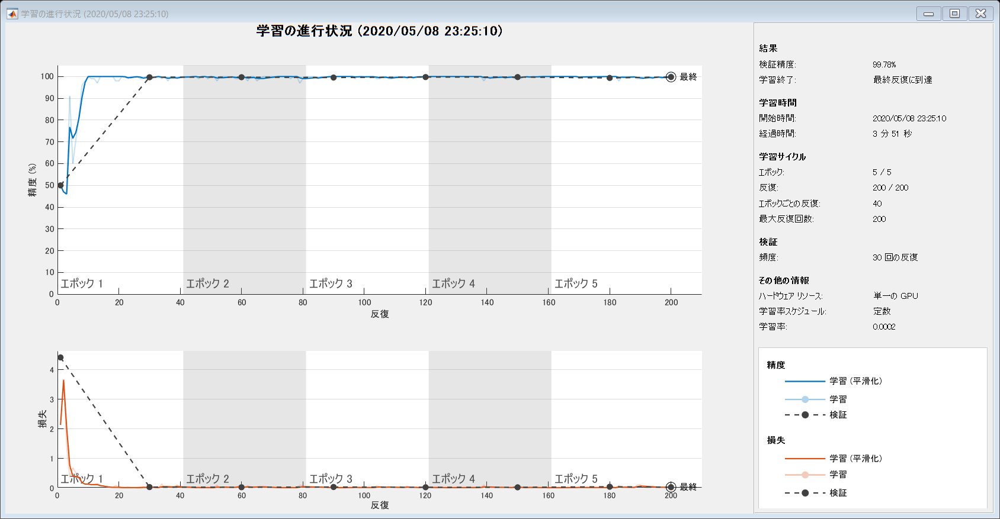
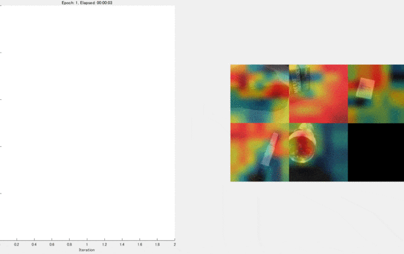
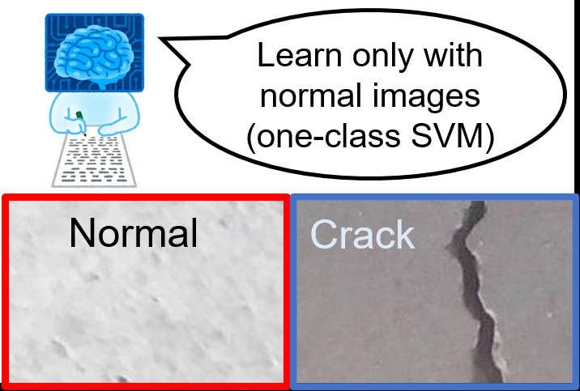

[](https://jp.mathworks.com/matlabcentral/fileexchange/75418-classify-crack-image-using-deep-learning-and-explain-why)
# Classify crack images and explain why using MATLAB

**[English]**

This demo shows how to fine-tune a pretrained deep convolutional network called SqueezeNet [1] to perform a crack/normal image classification. The classification output was discussed using a technique to "explain why" called grad-cam as shown below. This script was created based on the official documentation [2]. For the grad-cam, I referred to [3]. About fine-tuning, please refer to the additional explanation [a] at the end of this script. In this demo, we use a dataset of concrete crack images introduced by L. Zhang [4]. The data is available at [5]. 

**[Japanese]**

この例では、深層学習を用いて、ひび割れ画像を分類するコードを示します。あらかじめ大規模な画像のデータセットで学習し、よい画像の特徴を捉えられる事前学習ネットワークを用いて、その構造をもとに学習したり、その重み初期値として利用します。また、grad-camとよばれる手法を用いて、分類の際に重要視された領域を可視化します。この例では、事前学習ネットワークの中でも非常にサイズの小さい、SqueezeNet [1] を用います。また、本デモでは、[2] [3]にある、公式ドキュメントを参考にしました。データセットは、[4]の論文で紹介されているデータセット [5]を用いました。

  

**[Key words]**

class activation mapping, classification, crack, deep learning, explainable, grad-cam

[1] [Iandola, Forrest N., Song Han, Matthew W. Moskewicz, Khalid Ashraf, William J. Dally, and Kurt Keutzer. "SqueezeNet: AlexNet-level accuracy with 50x fewer parameters and <0.5 MB model size." arXiv preprint arXiv:1602.07360 (2016).](https://arxiv.org/abs/1602.07360)

[2] Matlab Documentation: [Train Deep Learning Network to Classify New Images](https://jp.mathworks.com/help/deeplearning/ug/train-deep-learning-network-to-classify-new-images.html)

[3] Matlab Documentation: [Grad-CAM Reveals the Why Behind Deep Learning Decisions](https://jp.mathworks.com/help/deeplearning/ug/gradcam-explains-why.html?lang=en)

[4] [Zhang, Lei, et al. "Road crack detection using deep convolutional neural network." *2016 IEEE international conference on image processing (ICIP)*. IEEE, 2016.](https://ieeexplore.ieee.org/abstract/document/7533052)

[5] [Concrete Crack Images for Classification](https://data.mendeley.com/datasets/5y9wdsg2zt/1) 

# Load Data

First of all, please download "Concrete Crack Images for Classification" from [4]. Then unzip it to name as Concrete Crack Images for Classification. Please run this code after confirming that the file is in your current directory as shown below.  



Use `imageDatastore` function to store images with the label information. The label information was recognized based on the folder name in the file, Concrete Crack Images for Classification. 

```matlab:Code
clear;clc;close all
imds = imageDatastore('Concrete Crack Images for Classification','IncludeSubfolders',true, 'LabelSource','foldernames');
```

This dataset contains normal (Negative) and crack images (Positive). Display some sample images.

```matlab:Code
numExample=16;
idx = randperm(numel(imds.Files),numExample);
for i=1:numExample
    I=readimage(imds,idx(i));
    I_tile{i}=insertText(I,[1,1],string(imds.Labels(idx(i))),'FontSize',20);
end
% use imtile function to tile out the example images
I_tile = imtile(I_tile);
figure;imshow(I_tile);title('examples of the dataset')
```



# Dividing images

Divide the data into training, validation and test data sets. The function `splitEachLabel` splits the `images` datastore into two new datastores. This dataset contains 20k normal images and 20k crack images. As the dataset has numerous images, it takes some time to train. Just for enjoying this demo, you can set the ratio for training images low, such as 0.1 to get the number of images very small. 

The ratio after `imds` represets the ratio with which the number of images for train, validation and test data are determined.  

For example, if the ratio is 0.1, the number of images is 40k*0.1=4000. 



```matlab:Code
[imdsTrain,imdsValidation,imdsTest] = splitEachLabel(imds,0.1,0.1,0.1,'randomized');
```

Count the number of images in the training dataset. Confirm if the number is as expected from above. 

```matlab:Code
numTrainImages = numel(imdsTrain.Labels)
```

```text:Output
numTrainImages = 4000
```

# Load Pretrained Network

Load the pretrained `SqueezeNet` neural network. Squeezenet is the smallest pre-trained network among the networks available officially supported by Matlab. 

```matlab:Code
net = squeezenet;
```

Use `analyzeNetwork` to display an interactive visualization of the network architecture and detailed information about the network layers.

```matlab:Code
analyzeNetwork(net)
```



The first layer, the image input layer, requires input images of size 227-by-227-by-3, where 3 is the number of color channels. 

```matlab:Code
inputSize = net.Layers(1).InputSize
```

```text:Output
inputSize = 1x3    
   227   227     3

```

# Replace Final Layers

As the original version of the SqueezeNet is a network for 1000 classes, we have to adapt it to normal/crack classification (2-classes).  



Extract the layer graph from the trained network.

```matlab:Code
lgraph = layerGraph(net); 
```

In most networks, the last layer with learnable weights is a fully connected layer. In some networks, such as `SqueezeNet`, the last learnable layer is a 1-by-1 convolutional layer instead. In this case, we added a fully connected layer before softmax layer. 

```matlab:Code
numClasses = numel(categories(imdsTrain.Labels))
```

```text:Output
numClasses = 2
```

Remove the classification layer for 1000 classes and relace it by the new layers for our task.

```matlab:Code
newlgraph = removeLayers(lgraph,{'ClassificationLayer_predictions'});
lgraph = replaceLayer(newlgraph,'prob',[fullyConnectedLayer(numClasses,'Name','fc_add');softmaxLayer('Name','softmax_layer'); classificationLayer('Name','new_classoutput')]);
```

The classification layer specifies the output classes of the network. Replace the classification layer with a new one without class labels. `trainNetwork` automatically sets the output classes of the layer at training time.

# Prepare for augmentation

The network requires input images of size 227-by-227-by-3, but the images in the image datastores have different sizes. Use an augmented image datastore to automatically resize the training images. Specify additional augmentation operations to perform on the training images: randomly flip the training images along the vertical axis, and randomly translate them up to 30 pixels horizontally and vertically. Data augmentation helps prevent the network from overfitting and memorizing the exact details of the training images.  

```matlab:Code
pixelRange = [-30 30];
imageAugmenter = imageDataAugmenter( ...
    'RandXReflection',true, ...
    'RandXTranslation',pixelRange, ...
    'RandYTranslation',pixelRange);
augimdsTrain = augmentedImageDatastore(inputSize(1:2),imdsTrain, ...
    'DataAugmentation',imageAugmenter);
```

To automatically resize the validation and test images without performing further data augmentation, use an augmented image datastore without specifying any additional preprocessing operations.

```matlab:Code
augimdsValidation = augmentedImageDatastore(inputSize(1:2),imdsValidation);
augimdsTest = augmentedImageDatastore(inputSize(1:2),imdsTest);
```

# Train Network

Specify the training options. As an optimizer, we use `adam` optimizer. 

```matlab:Code
options = trainingOptions('adam', ...
    'MiniBatchSize',100, ...
    'MaxEpochs',5, ...
    'InitialLearnRate',2e-4, ...
    'Shuffle','every-epoch', ...
    'ValidationData',augimdsValidation, ...
    'ExecutionEnvironment',"auto", ...
    'ValidationFrequency',30, ...
    'Verbose',false, ...
    'Plots','training-progress');
```

The network is trained on GPU if available. It is specified by `ExecutionEnvironment`,"auto" as above. 

```matlab:Code
netTransfer = trainNetwork(augimdsTrain,lgraph,options);
```



# Classify test Images to calculate the classification accuracy

Classify the test images of the normal and crack images using the fine-tuned network.

You can use classify function to `classify` the images using a network. 

```matlab:Code
[YPred,scores] = classify(netTransfer,augimdsTest);
```

Display four sample validation images with their predicted labels.

Calculate the classification accuracy on the validation set. Accuracy is the fraction of labels that the network predicts correctly.

```matlab:Code
YTest = imdsTest.Labels;
accuracy = mean(YPred == YTest)
```

```text:Output
accuracy = 0.9978
```

# Explore "why" using grad-cam

For the detail of grad-cam, please refer to  Matlab Documentation: [Grad-CAM Reveals the Why Behind Deep Learning Decisions](https://jp.mathworks.com/help/deeplearning/ug/gradcam-explains-why.html?lang=en). 

```matlab:Code
lgraph = layerGraph(netTransfer);
```

To access the data that `SqueezeNet` uses for classification, remove its final classification layer.

```matlab:Code
lgraph = removeLayers(lgraph, lgraph.Layers(end).Name);
```

Create a `dlnetwork` from the layer graph.

```matlab:Code
dlnet = dlnetwork(lgraph);
```

Specify the name for Grad-cam. 

```matlab:Code
softmaxName = 'softmax_layer';
featureLayerName = 'relu_conv10';
```

dispNum controls the number of images to use grad-cam. 

```matlab:Code
dispNum=12;
idx = randperm(numel(imdsTest.Files),dispNum);
C=cell(dispNum,1);
figure
for i = 1:dispNum
img = readimage(imdsValidation,idx(i));

[classfn,~] = classify(netTransfer,img);
```

To use automatic differentiation, convert the sherlock image to a `dlarray`.

```matlab:Code
dlImg = dlarray(single(img),'SSC');
```

Compute the Grad-CAM gradient for the image by calling `dlfeval` on the `gradcam` function.

```matlab:Code
[featureMap, dScoresdMap] = dlfeval(@gradcam, dlnet, dlImg, softmaxName, featureLayerName, classfn);
```

Resize the gradient map to the SqueezeNet image size, and scale the scores to the appropriate levels for display.

```matlab:Code
gradcamMap = sum(featureMap .* sum(dScoresdMap, [1 2]), 3);
gradcamMap = extractdata(gradcamMap);
gradcamMap = rescale(gradcamMap);
subplot(3,4,i)
imshow(img);title(classfn)
hold on;
subplot(3,4,i)
imagesc(imresize(gradcamMap,inputSize(1:2) ,'Method', 'bicubic'),'AlphaData',0.5);
colormap jet
hold off;
end
```


Show the Grad-CAM levels on top of the image by using an `'AlphaData'` value of 0.5. The `'jet'` colormap has deep blue as the lowest value and deep red as the highest.

This kind of visualization to show where is important for the classification can be done during the traing process, too. We can confirm that the network graducally learns a good feature for the classification. For the demo, please look [here](https://jp.mathworks.com/matlabcentral/fileexchange/74639-continuous-activation-map-generation-at-training-process).  

Kenta (2020). Continuous activation map generation at training process (https://www.github.com/giants19/Continuous-class-activation-generation-during-training-process-using-Matlab), GitHub. Retrieved May 8, 2020.



If the number of anomaly images is totally limited, you can learn only with normal images using, for example, one-class SVM.

For the demo, please check [here](https://jp.mathworks.com/matlabcentral/fileexchange/75356-crack-detection-using-one-class-svm-1-svm).  



  
# Helper function

```matlab:Code
function [featureMap,dScoresdMap] = gradcam(dlnet, dlImg, softmaxName, featureLayerName, classfn)
[scores,featureMap] = predict(dlnet, dlImg, 'Outputs', {softmaxName, featureLayerName});
classScore = scores(classfn);
dScoresdMap = dlgradient(classScore,featureMap);
end
```

# Additional explanations

[a] SqueezeNet has been trained on over a million images and can classify images into 1000 object categories (such as keyboard, coffee mug, pencil, and many animals). The network has learned rich feature representations for a wide range of images. The network takes an image as input and outputs a label for the object in the image together with the probabilities for each of the object categories (cited from the official document).

[b] Transfer learning is commonly used in deep learning applications. You can take a pretrained network and use it as a starting point to learn a new task. Fine-tuning a network with transfer learning is usually much faster and easier than training a network with randomly initialized weights from scratch. You can quickly transfer learned features to a new task using a smaller number of training images (cited from the official document).
